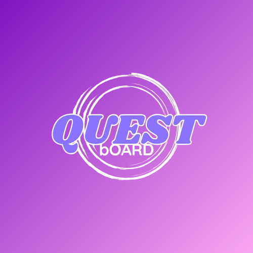

# Quest Board

**A playful, gamified todo app for daily tasks and study resources.**

🔗 **[Visit Quest Board](https://your-app.vercel.app)**

---

## What is Quest Board?

Quest Board turns your daily tasks into **quests** — a streak flame that tracks how many days in a row you've
shown up, and a rotating daily motivational quote to nudge you along.

Alongside your quests, it doubles as a lightweight resource manager: save
links to articles, docs, or anything you're studying, so they live in one
tidy place instead of scattered across a dozen browser tabs.

Sign in with your Google account and everything is yours alone — private,
saved automatically, and there the next time you open the site.

## How it helps

- **Keeps you motivated daily** — a new motivational quote greets you every
  time you open the board
- **Organizes what you're studying** — save and revisit useful links in one
  place instead of losing them in your browser history
- **Nothing to set up** — just sign in with Google and start; no accounts,
  passwords, or configuration
- **Private and yours** — every quest and resource is tied to your account
  only; no one else can see or touch it

## Tech stack

| Layer      | Choice                                                        |
|------------|-----------------------------------------------------------------|
| Framework  | [Next.js](https://nextjs.org) (App Router, React)               |
| Auth       | [NextAuth.js](https://next-auth.js.org) with Google OAuth       |
| Database   | [PostgreSQL](https://www.postgresql.org) via [Prisma](https://prisma.io) ORM |
| Language   | TypeScript                                                      |
| Styling    | Plain CSS (custom design system, no UI framework)  
---

Built with Next.js, NextAuth, Prisma, and PostgreSQL.
